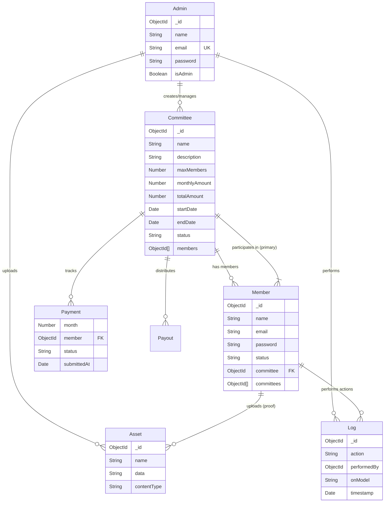

# CommittieApp Documentation

This document provides a comprehensive overview of the CommittieApp, including its architecture, user flows, database schema, and key components.

## 1. logical Flow & Architecture

The application is built using **Next.js 14 (App Router)** and follows a role-based architecture separating **Members** and **Admins**.

### User Journeys

#### **Public User**
1.  **Landing Page (`/`)**: Users see the "How It Works" section.
2.  **Login (`/login`)**: Members log in using their email and password.
3.  **Password Reset (`/reset-password`)**: Functionality to recover accounts.

#### **Member**
1.  **Dashboard (`/userDash`)**:
    -   After login, members are redirected here.
    -   View their committee participation, status, payments, and payouts.

#### **Admin**
1.  **Login (`/adminLogin`)**: Separate login portal for administrators.
2.  **Dashboard (`/admin`)**:
    -   **Overview**: System health, active pools, total valuation, real-time stats.
    -   **Committee Management**:
        -   **View**: List of all operational pools/committees.
        -   **Create**: Add new committees (`/admin/create`).
        -   **Edit/Delete**: Modify or remove existing committees.
        -   **Manage**: Detailed management of a specific committee (`/admin/manage?id=...`).
        -   **Announcements**: specific announcements for committees (`/admin/announcement?id=...`).

### Application Flow Diagram

```mermaid
graph TD
    %% Entry Points
    Landing[Landing Page /] --> |"Sign In"| Login[/login]
    Landing --> |"Admin Access"| AdminLogin[/adminLogin]

    %% Authentication
    Login --> |Success + JWT| UserDash[User Dashboard /userDash]
    AdminLogin --> |Success + Token| AdminDash[Admin Dashboard /admin]

    %% User Flow
    UserDash --> ViewCommittees[View My Committees]
    UserDash --> ViewHistory[View Payment History]

    %% Admin Flow
    AdminDash --> ManageCommittees[Manage Committees]
    AdminDash --> ManageMembers[Manage Members]
    AdminDash --> SystemLogs[View System Logs]

    ManageCommittees --> Create[Create New Pool]
    ManageCommittees --> Edit[Edit Pool]
    ManageCommittees --> Details[Manage Pool Details]
    
    Details --> ApproveMembers[Approve Members]
    Details --> TrackPayments[Track Payments]
    Details --> VerifyTrans[Verify Transactions]
```

## 2. Database Schema

The application uses **MongoDB** with **Mongoose** OM.

### Entity-Relationship Diagram (ERD)



## 3. Technology Stack

-   **Frontend Framework**: Next.js 14 (App Router)
-   **UI Library**: React 18
-   **Styling**: Tailwind CSS, FontAwesome
-   **State Management**: Redux Toolkit, Context API (Language)
-   **Database**: MongoDB
-   **ORM**: Mongoose
-   **Authentication**: JSON Web Tokens (JWT), BcryptJS
-   **Notifications**: React Toastify, Nodemailer (Email)

## 4. Key Component Analysis

| Component | Path | Description |
| :--- | :--- | :--- |
| **Root Layout** | `app/layout.tsx` | Global layout wrapper. Handles Fonts, Toast notifications, Language Context, and the main Navbar. |
| **Login Page** | `app/login/page.tsx` | Client-side form handling user authentication. Stores JWT in `localStorage`. |
| **Admin Dashboard** | `app/admin/page.jsx` | "Commander" view. Displays high-level stats (System Health, Valuation) and lists active Committees using the `Committiee` component. |
| **Committee List** | `app/admin/Committie.jsx` | Core admin component. Fetches committees, renders cards with operational details (members count, cycle, monthly pulse), and provides actions (Manage, Edit, Delete). |
| **API Routes** | `app/api/*` | Backend logic. `route.js` files handle CRUD operations for models like Committees, Members, and Logs. |
