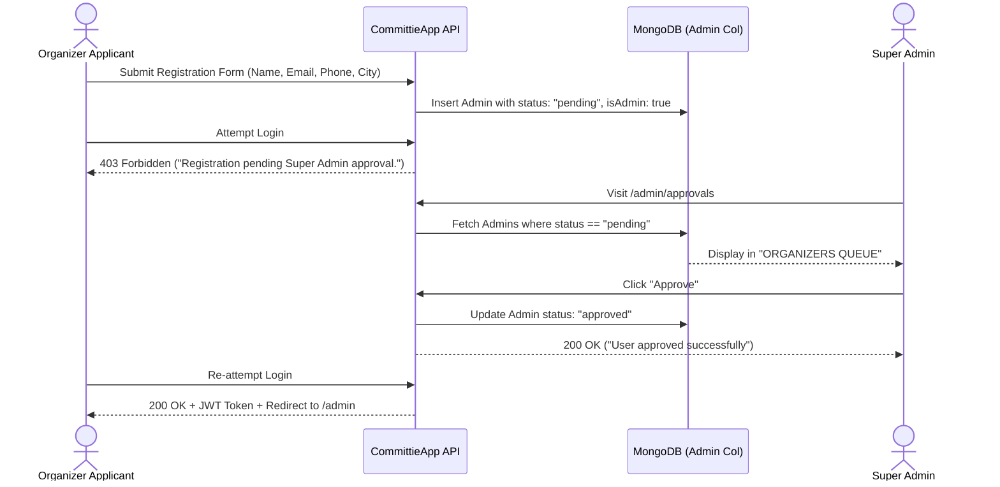

# 07 — Organizer Request & Super Admin Approval Flow

**Associated Routes**:
- `/admin/register` (Organizer Registration)
- `/admin/login` (Organizer Sign In)
- `/admin/approvals` (Super Admin Approval Console)

**Associated Screenshots**:
- `public/screenshot/super-admin/pending-organizers.png`
- `public/screenshot/super-admin/organizer-approved.png`

---

## 1. The Governance Imperative

In traditional Kameti circles, organizers (Kameti Daalney Walay) handle large sums of collective cash. To protect participants from unauthorized or fraudulent organizers, CommittieApp enforces a strict Super Admin gatekeeping layer:

---

## 2. Pending Organizer Queue (`/admin/approvals`)

### Screen Architecture:
- **ORGANIZERS QUEUE Counter**: Live badge showing number of organizers awaiting review.
- **Card Metadata**: Displays organizer's Full Legal Name, Email Address, Phone Number, and Locality.
- **Action Controls**:
  - **Approve (منظور کریں)**: Calls `POST /api/admin/manage` or `POST /api/member/approve` with `{ adminId, status: "approved" }`.
  - **Reject (مسترد کریں)**: Purges application or flags as rejected with notice.

---

## 3. Approval Execution & State Transition

- Once approved, an instant toast notification *"User approved successfully"* appears.
- The queue dynamically updates to 0 pending.
- The organizer's record in MongoDB updates `status: "approved"`.
- The organizer can now log in at `/admin/login` and access the complete Organizer Console.
