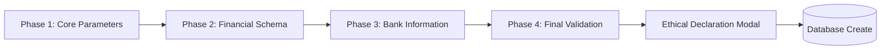

# 09 — Create Committee 4-Step Wizard

**Associated Route**: `/admin/create`  
**Target Role**: Committee Organizer (منتظم)  
**Associated Screenshot**: `public/screenshot/organizer/create-committee.png`  

---

## 1. Wizard Architecture

Creating a committee is structured as a guided 4-step wizard with built-in validation at every phase.

---

## 2. Phase-by-Phase Breakdown

### Phase 1: Core Parameters (بنیادی ترتیبات)
- **Committee Name (`name`)**: Public title (e.g., *"QA Alpha Circle"*).
- **Max Members (`maxMembers`)**: Participant capacity (e.g., 5, 10, 12).
- **Description (`description`)**: Rules, target purpose, and payout frequency.

### Phase 2: Financial Schema (مالیاتی ڈھانچہ)
- **Monthly Amount (`monthlyAmount`)**: PKR installment per participant per cycle (e.g., `5000`).
- **Duration (`monthDuration`)**: Total months (automatically validated against member count).
- **Start Date (`startDate`)**: Scheduled date for Month 1.
- **End Date (`endDate`)**: Computed expiration date.
- **Organizer Fee (Optional)**: Specific service fee if applicable.

### Phase 3: Bank Information (بینک کی تفصیلات)
- **Account Title (`accountTitle`)**: Legal name matching bank account.
- **Bank Name (`bankName`)**: Official institution (e.g., *Meezan Bank, HBL, Allied Bank*).
- **IBAN (`iban`)**: 24-character international bank account number.

### Phase 4: Final Calibration & Review
- Summary display reviewing all parameters before creation.

---

## 3. Organizer Ethical Declaration (حلف نامہ)

Before the pool is committed to the database, a legally grounded ethical modal is displayed:

> **ORGANIZER ETHICAL DECLARATION**  
> 1. I solemnly swear to manage the pooled assets with absolute transparency and integrity.  
> 2. I acknowledge my responsibility to disburse payouts timely as per the defined cycle logic.  
> 3. In case of a member's unforeseen uncertainty (death, insolvency), I agree to follow the predetermined succession plan or community-led resolution.  
> 4. I understand that mismanagement or fraud will result in immediate termination of organizer privileges and legal pursuit under PPC Section 406/420.  
> 5. I accept full ethical and management responsibility.

Clicking **"ESTABLISH POOL"** persists the document to `POST /api/committee` and creates the committee with status `"open"`.
