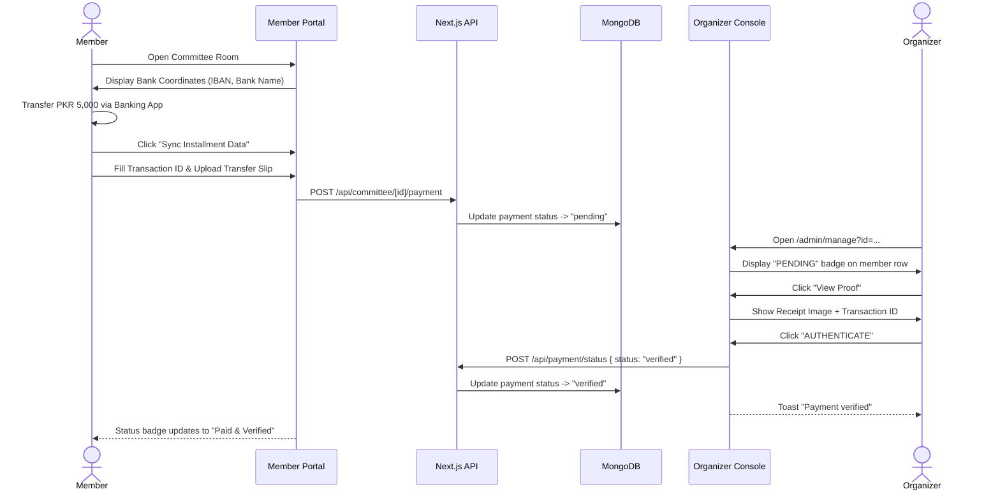

# 11 — Monthly Payment Workflow & Authentication

**Associated Routes**:
- `/userDash/committee/[id]` (Member Payment Submission)
- `/admin/manage?id=...` (Organizer Payment Review)

**Associated Screenshots**:
- `public/screenshot/member/payment-proof-upload.png`
- `public/screenshot/organizer/payment-approvals.png`

---

## 1. End-to-End Payment Sequence

---

## 2. Member Proof Submission Modal

- **Base Installment**: Displayed clearly (e.g. `RS 5,000`).
- **Transaction ID / Protocol Ref**: Text input for bank transaction reference number.
- **Transfer Evidence**: Multi-source upload component (Gallery, Camera, or Asset Library).
- **Submission Trigger**: `FINALIZE & SYNC` sends data to API and closes modal.

---

## 3. Organizer Verification & Authentication Modal

- **Transaction Identity**: Displays entered reference ID (e.g. `TXN-9988776655`).
- **Timestamp**: Exact submission date and time.
- **Member Testimony**: Optional note submitted by member (e.g. *"Paid via Meezan Mobile App"*).
- **Decision Controls**:
  - **AUTHENTICATE (Emerald)**: Confirms receipt and locks payment record as verified.
  - **FLAG IRREGULARITY (Red)**: Rejects payment proof with reason notification to member.
