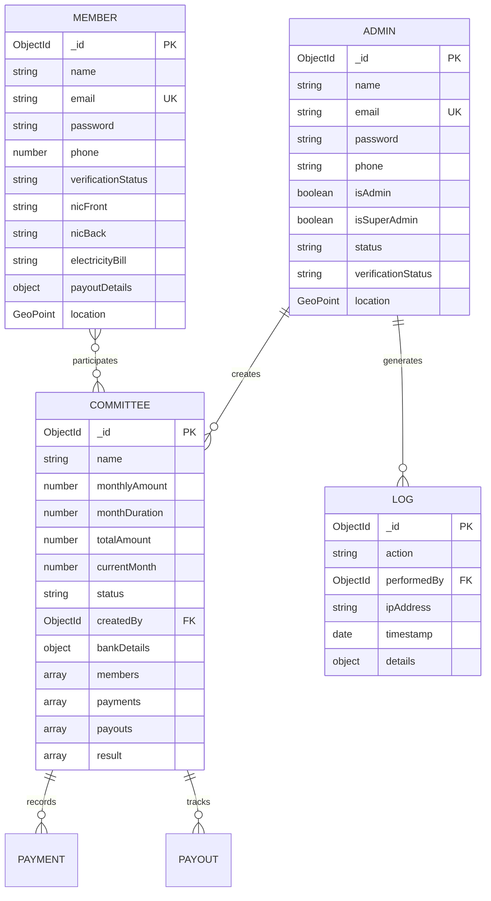

# 17 — Database Models & API Architecture

---

## 1. Database Entity Models (MongoDB / Mongoose)

---

## 2. Core API Route Registry

### Authentication Routes
- `POST /api/login` — Member authentication; returns JWT and member document.
- `POST /api/register` — Member signup; hashes password with bcrypt.
- `POST /api/admin/login` — Organizer/Admin login; verifies approved status.

### Committee Routes
- `GET /api/committee` — Returns committees (filtered by creator for organizers, all for super admin).
- `POST /api/committee` — Creates a new savings circle.
- `GET /api/committee/[id]/details` — Detailed committee room state for members.
- `POST /api/committee/[id]/request` — Submits member join request.
- `POST /api/committee/[id]/status` — Advances month or closes committee.

### Payment & Payout Routes
- `POST /api/committee/[id]/payment` — Member submits transfer proof.
- `POST /api/payment/status` — Organizer authenticates or rejects payment.
- `POST /api/committee/[id]/payout` — Organizer logs payout disbursement.
