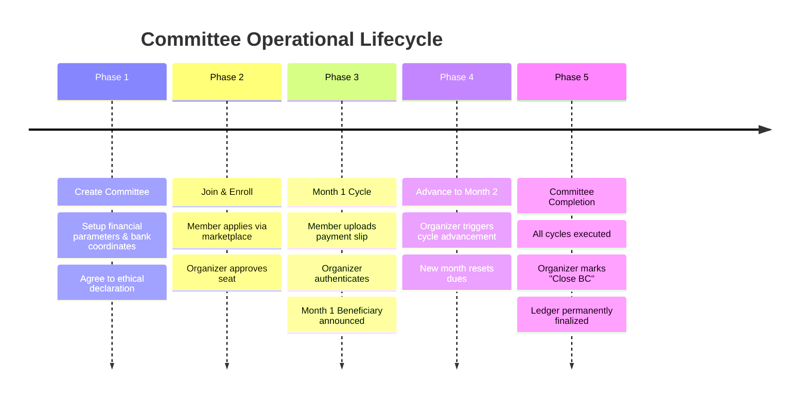

# 19 — Complete Lifecycle Walkthrough

**Associated Screenshots**:
- `public/screenshot/lifecycle/committee-created.png`
- `public/screenshot/lifecycle/member-joined.png`
- `public/screenshot/lifecycle/month-01.png`
- `public/screenshot/lifecycle/month-02.png`
- `public/screenshot/lifecycle/committee-completed.png`

---

## 1. Simulation Scenario

To empirically test the platform's lifecycle integrity, a 5-month, PKR 5,000/month committee (*"QA Alpha Circle"*) was established and driven from creation through closure.

---

## 2. Phase 1: Committee Creation

- Organizer accesses `/admin/create`.
- Specifies `name: "QA Alpha Circle"`, `maxMembers: 5`, `monthlyAmount: 5000`, `monthDuration: 5`.
- Agrees to the ethical declaration and clicks *"ESTABLISH POOL"*.
- Status initialized as `"open"`.

---

## 3. Phase 2: Member Joining & Seat Assignment

- Member `member_qa@example.com` browses marketplace at `/userDash/explore`.
- Dispatches join request.
- Organizer approves participant into the active roster.
- Status updates to `"ongoing"` with 1 enrolled member.

---

## 4. Phase 3: Month 1 Execution & Payment Proof

- Member accesses Committee Room, checks bank coordinates, and submits transfer reference `TXN-9988776655` with receipt image.
- Status moves to `"pending"`.
- Organizer reviews receipt in modal and clicks `AUTHENTICATE`.
- Payment status transitions to `"verified"`.
- Drawing assigns `QA Member` as Month 1 beneficiary for PKR 25,000 payout.

---

## 5. Phase 4: Advance to Month 2

- With Month 1 reconciled, organizer clicks **ADVANCE MONTH**.
- Confirm dialog verified: *"Are you sure you want to advance to the next month? This will notify the next winner."*
- Cycle counter updates: `Month 2 of 5`.
- Payment table resets for Month 2 dues.

---

## 6. Phase 5: Committee Finalization (Close BC)

- Upon reaching cycle culmination, organizer clicks **CLOSE BC**.
- Status updates to `"finished"`.
- Action buttons are locked, and the immutable historical ledger is preserved for auditing.
